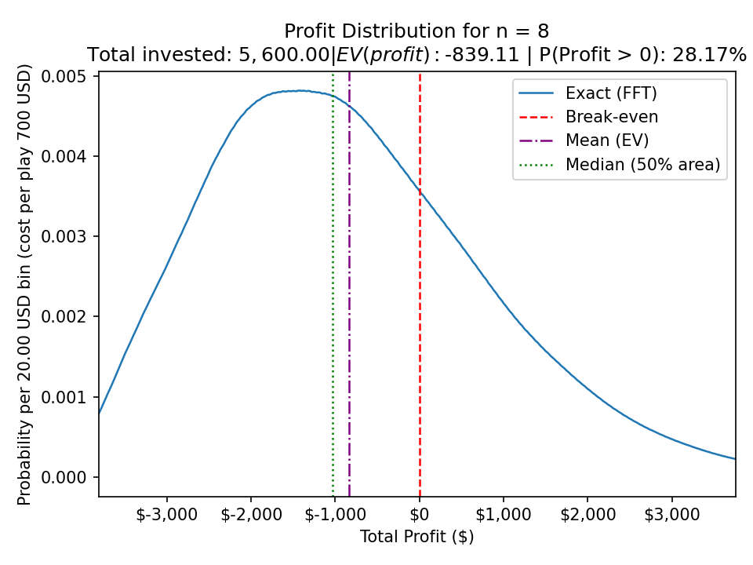

# CS2-Trade-Up-Profitability-Calculator-Distribution-Visualizer
Python script that models CS2 trade-up profitability from a loot-table CSV, bins outcomes, computes exact profit distributions for multiple runs using FFT convolution, and outputs graphs/CSVs with EV, win chance, and median profit stats.
The script calculates and visualizes the profit distribution of CS2 trade-ups (or similar randomized openings) using a loot table CSV.

It takes item values and probabilities as input, then:
> calculates the profit per play (item value - cost per play)
> builds a probability distribution for one play
> computes the distribution for multiple plays (n runs) using FFT-based convolution (fast and accurate)
> generates a profit probability graph for each n
> exports the resulting distributions to CSV files

The script also reports useful stats like:
> Expected value (EV) / expected profit
> Standard deviation
> Probability of ending in profit (P(total profit > 0))
> Median total profit

For larger sample sizes (n >= 20), it can optionally overlay a normal distribution approximation for comparison.

Input CSV format - 
Your CSV must contain these columns:
> Item
> ValueUSD
> Probability
> If probabilities don’t sum to 1, the script automatically renormalizes them.

Outputs - 

For each n in NS, the script saves:
> profit_pmf_n{n}.png → graph of total profit distribution
> profit_pmf_n{n}.csv → exact probability mass function (PMF)
> all_pmfs_long.csv → combined long-format PMFs for all n
> summary_ns.csv → summary of tested n values

Notes:
> Profit values are binned (e.g. $20 bins) for performance and cleaner plots.
> The multi-play distribution is computed using FFT convolution, which is much faster than repeated direct convolution for large n.

## Sample Output

### Profit Distribution Graph

### Example CSV Outputs
- [Summary stats (`summary_ns.csv`)](sample_outputs/summary_ns.csv)
- [Profit PMF (`profit_pmf_n8.csv`)](sample_outputs/profit_pmf_n8.csv)
- [Combined PMFs (`all_pmfs_long.csv`)](sample_outputs/all_pmfs_long.csv)
